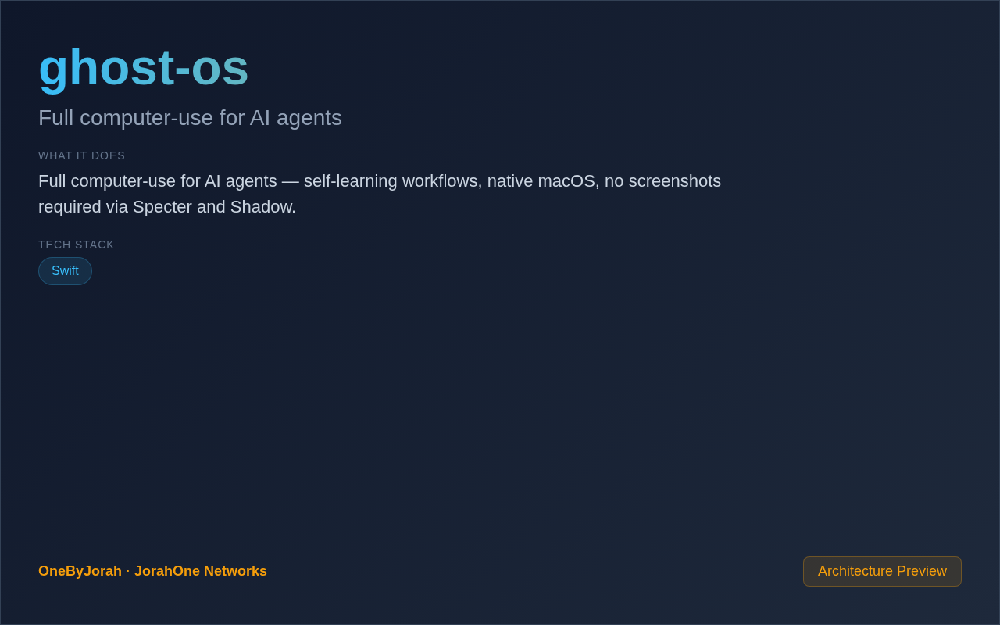

<div align="center">


# ghost-os

Full computer-use for AI agents


</div>

---

<p align="center">
  
</p>

<br>

---

## Features

- **Full Computer-Use** — AI agents can interact with macOS natively.
- **Self-Learning Workflows** — Agents learn from completed tasks.
- **No Screenshots** — Direct accessibility API access, no vision required.
- **Persistent Memory** — Agents remember past interactions.
- **Multi-Modal** — Support for text, voice, and screen interactions.
- **Native macOS** — Deep integration with macOS accessibility features.
- **Specter Engine** — Core computer-use automation framework.
- **Shadow Agent** — Background agent for persistent assistance.

## Quick Start

### Prerequisites

- macOS 12+ (Monterey or later)
- Accessibility permissions granted
- Python 3.10+

### Installation

```bash
git clone https://github.com/OneByJorah/ghost-os.git
cd ghost-os

pip install -r requirements.txt

python3 setup.py setup-accessibility

# Run the agent
python3 ghost.py
```

## Tools

### Specter

The core computer-use engine:

```python
from ghost.specter import Specter

agent = Specter()
agent.click(element="Submit Button")
agent.type(text="Hello, world!")
agent.screenshot()  # Optional, not required
```

### Shadow

Persistent background agent:

```python
from ghost.shadow import Shadow

shadow = Shadow()
shadow.start()
# Agent runs in background, learning from tasks
```

## Architecture

```
AI Agent ──API──▶ Ghost OS ──Accessibility──▶ macOS
                         │
                         ├──▶ Specter (Computer-Use)
                         ├──▶ Shadow (Persistent Agent)
                         ├──▶ Memory Store
                         └──▶ Workflow Engine
```

## Project Structure

```
ghost-os/
├── ghost/
│   ├── __init__.py
│   ├── specter.py         # Core computer-use engine
│   ├── shadow.py          # Persistent background agent
│   ├── memory.py          # Memory and context store
│   ├── workflow.py        # Workflow automation
│   └── accessibility.py   # macOS accessibility wrapper
├── workflows/             # Pre-built workflows
├── memory/                # Agent memory storage
├── ghost.py               # Main entry point
├── requirements.txt       # Python dependencies
└── README.md
```

## Capabilities

| Capability | Description |
|------------|-------------|
| Click | Click any UI element by accessibility |
| Type | Type text into focused elements |
| Scroll | Scroll in any direction |
| Navigate | Open apps, switch windows |
| Read | Read text from screen (accessibility) |
| Search | Find elements by accessibility tree |

## Contributing

Contributions are welcome. Please see [CONTRIBUTING.md](CONTRIBUTING.md) for guidelines and [CODE_OF_CONDUCT.md](CODE_OF_CONDUCT.md) for community standards.

## Security

For security concerns, see [SECURITY.md](SECURITY.md). Please report vulnerabilities to **info@jorahone.com** — do not use public issues.

## License

MIT © Jhonattan L. Jimenez

---

## 🤝 Contributing

See [CONTRIBUTING.md](CONTRIBUTING.md). All contributions follow the [Code of Conduct](CODE_OF_CONDUCT.md).

## 🔒 Security

Found a vulnerability? Please follow our [Security Policy](SECURITY.md) and report privately to `security@jorahone.com`.

## 📄 License

[MIT License](LICENSE) © Jhonattan L. Jimenez (OneByJorah)

---

<p align="center">Built with 🌴 by <a href="https://github.com/OneByJorah">OneByJorah</a> · <a href="https://jorahone.com">jorahone.com</a></p>
